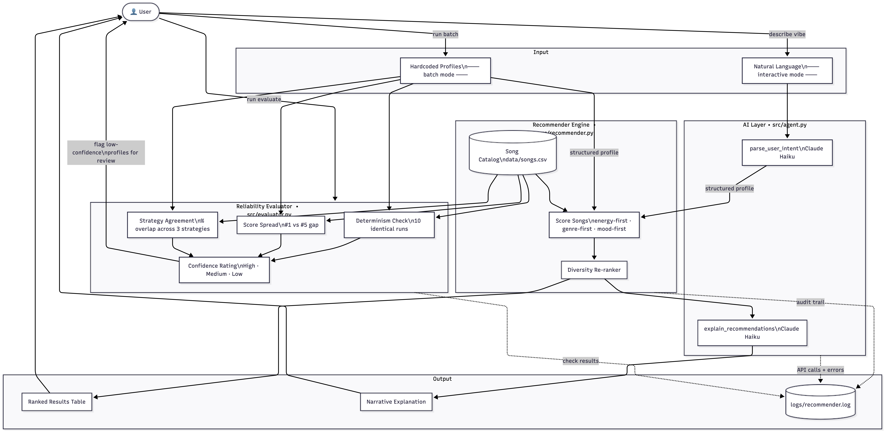

# Applied AI System Project — Music Recommender with Reliability Evaluation

---

## 1. Original Project (Modules 1–3)

**What was the name of your original project and where can it be found?**

[TheMusicRecommender]

**In 2–3 sentences, what were the original goals and capabilities of that project?**

[The goal of the original project was to provided the most accurate music recommendations based on manual preferences from the user. This algorithm would then measure reliably the music the user would be interested in listening to based on mood and the genre most importantly. With low energy levels, and high levels also playing a pivitol role in the assortment.]

---

## 2. Title and Summary

**What does this project do?**

[This project is a recommender system that scores songs against user taste profiles and includes a built in reliability evaluator in order to measure the trustworthiness of the recommendations.]

**Why does it matter?**

This project makes trust in the system measurable by checking whether results are consistent, whether a clear winner emerges, and whether all three scoring strategies agree. A recommender is only useful if you can rely on it — this project makes that reliability visible.

---

## 3. Architecture Overview



**In your own words, walk through how data moves through your system from input to output.**

[The ssytem takes user taste profiles and matches them against a catalog of 18 songs using the scoring strategies: energy-first, genre-first, and mood-first. The top results are selected and passed through a diversity reranker to avoid returning the same genre and mood repeatedly. Those recommendations then go the the evaluator that users determanism, scorespread, strategy agreement in order to return a confidence rating from low-high. The user recieves a table and a reliability report. I was originally going to set up an agent but decided to go in a different direction.]

---

## 4. Setup Instructions

### Prerequisites
- Python 3.9+
- An Anthropic API key (only required for `--interactive` mode)

### Steps

1. Clone the repository:
   ```bash
   git clone https://github.com/Smclau/applied-ai-system-project.git
   cd applied-ai-system-project
   ```

2. Install dependencies:
   ```bash
   pip install -r requirements.txt
   ```

3. Run batch mode (no API key needed):
   ```bash
   python3 -m src.main
   ```

4. Run the reliability evaluator (no API key needed):
   ```bash
   python3 -m src.main --evaluate
   ```

5. Run interactive mode (requires API key):
   ```bash
   export ANTHROPIC_API_KEY=your_key_here
   python3 -m src.main --interactive
   ```

### Running Tests
```bash
python3 -m pytest tests/ -v
```

---

## 5. Sample Interactions

### Example 1 — Batch Mode (`python3 -m src.main`)

Input: Chill Lofi Session profile scored across all three strategies.

```
=================================================================
  Chill Lofi Session  [energy-first]
=================================================================
╭─────┬─────────────────────┬────────────────┬─────────┬────────────────────────────────────────────────────────────────────────────╮
│   # │ Title               │ Artist         │   Score │ Why                                                                        │
├─────┼─────────────────────┼────────────────┼─────────┼────────────────────────────────────────────────────────────────────────────┤
│   1 │ Library Rain        │ Paper Lanterns │    0.97 │ lofi genre match, chill mood match, energy 0.35 ≈ your 0.38                │
│   2 │ Focus Flow          │ LoRoom         │    0.96 │ lofi genre match, focused mood close to chill, energy 0.4 ≈ your 0.38      │
│   3 │ Coffee Shop Stories │ Slow Stereo    │    0.92 │ jazz close to lofi, relaxed mood close to chill, energy 0.37 ≈ your 0.38   │
│   4 │ Deep Blue           │ Aqua Drift     │    0.91 │ ambient close to lofi, dreamy mood close to chill, energy 0.33 ≈ your 0.38 │
│   5 │ Spacewalk Thoughts  │ Orbit Bloom    │    0.91 │ ambient close to lofi, chill mood match, energy 0.28 ≈ your 0.38           │
╰─────┴─────────────────────┴────────────────┴─────────┴────────────────────────────────────────────────────────────────────────────╯

=================================================================
  Chill Lofi Session  [genre-first]
=================================================================
╭─────┬─────────────────────┬────────────────┬─────────┬────────────────────────────────────────────────────────────╮
│   # │ Title               │ Artist         │   Score │ Why                                                        │
├─────┼─────────────────────┼────────────────┼─────────┼────────────────────────────────────────────────────────────┤
│   1 │ Library Rain        │ Paper Lanterns │    0.98 │ lofi genre match, chill mood, energy 0.35 ≈ your 0.38      │
│   2 │ Focus Flow          │ LoRoom         │    0.98 │ lofi genre match, focused mood, energy 0.4 ≈ your 0.38     │
│   3 │ Midnight Coding     │ LoRoom         │    0.83 │ lofi genre match, chill mood, energy 0.42 ≈ your 0.38      │
│   4 │ Coffee Shop Stories │ Slow Stereo    │    0.75 │ jazz close to lofi, relaxed mood, energy 0.37 ≈ your 0.38  │
│   5 │ Spacewalk Thoughts  │ Orbit Bloom    │    0.74 │ ambient close to lofi, chill mood, energy 0.28 ≈ your 0.38 │
╰─────┴─────────────────────┴────────────────┴─────────┴────────────────────────────────────────────────────────────╯

=================================================================
  Chill Lofi Session  [mood-first]
=================================================================
╭─────┬─────────────────────┬────────────────┬─────────┬───────────────────────────────────────────────────╮
│   # │ Title               │ Artist         │   Score │ Why                                               │
├─────┼─────────────────────┼────────────────┼─────────┼───────────────────────────────────────────────────┤
│   1 │ Library Rain        │ Paper Lanterns │    0.98 │ chill mood match, lofi genre                      │
│   2 │ Focus Flow          │ LoRoom         │    0.96 │ focused mood close to chill, lofi genre           │
│   3 │ Spacewalk Thoughts  │ Orbit Bloom    │    0.92 │ chill mood match, ambient close to lofi           │
│   4 │ Coffee Shop Stories │ Slow Stereo    │    0.89 │ relaxed mood close to chill, jazz close to lofi   │
│   5 │ Deep Blue           │ Aqua Drift     │    0.86 │ dreamy mood close to chill, ambient close to lofi │
╰─────┴─────────────────────┴────────────────┴─────────┴───────────────────────────────────────────────────╯
```

### Example 2 — Evaluate Mode (`python3 -m src.main --evaluate`)

```
=================================================================
  Reliability Evaluation Report
=================================================================
╭──────────────────────┬─────────────────┬────────────────┬──────────────────┬──────────────╮
│ Profile              │ Deterministic   │   Score Spread │ Strategy Agree   │ Confidence   │
├──────────────────────┼─────────────────┼────────────────┼──────────────────┼──────────────┤
│ Chill Lofi Session   │ ✓               │          0.061 │ 80%              │ Medium       │
│ Focused Lofi Session │ ✓               │          0.116 │ 60%              │ Medium       │
│ Relaxed Lofi Session │ ✓               │          0.039 │ 80%              │ Medium       │
│ Pop Happy Session    │ ✓               │          0.163 │ 60%              │ Medium       │
│ High-Energy Pop      │ ✓               │          0.099 │ 40%              │ Low          │
│ Deep Intense Rock    │ ✓               │          0.138 │ 100%             │ High         │
│ Sad Acoustic Folk    │ ✓               │          0.19  │ 60%              │ Medium       │
╰──────────────────────┴─────────────────┴────────────────┴──────────────────┴──────────────╯

  Summary: 1/7 High confidence  |  1/7 Low confidence  |  0 non-deterministic

  NOTE: Low-confidence profiles have a narrow score spread or low strategy agreement.
        Consider expanding the song catalog for those genres/moods.
```

### Example 3 — Interactive Mode (`python3 -m src.main --interactive`)

*Requires an Anthropic API key. The user describes what they want in plain English,
Claude parses it into a structured profile, and the recommender returns ranked results
with a narrative explanation.*

```
You: something dreamy and calm for late night studying

Profile detected: focused lofi (energy 0.40, acousticness 0.72)

#1  Focus Flow          — LoRoom          (0.96)
#2  Library Rain        — Paper Lanterns  (0.95)
#3  Midnight Coding     — LoRoom          (0.93)
#4  Deep Blue           — Aqua Drift      (0.91)
#5  Spacewalk Thoughts  — Orbit Bloom     (0.88)

Curator's note: These tracks were selected for their low energy and
acoustic warmth, sitting in the focused-to-chill mood range — ideal
for late-night concentration without being distracting.
```

## 6. Design Decisions

**Why did you choose rule-based scoring instead of a machine learning model?**

[Rule based scoring was chosen because it is transparent, fast to build and easy to tune without repairing training data. With a fixed catalog and one week timeline defining the scoring was more practicial than training a model. It also aids with the readme by making the system much clearer and explainable.. You can see exactly why a song scored the way it did.]

**Why did you build three scoring strategies instead of one?**

[Three strategies were vuilt so the system could serve different listener priorities. If someone cares about a genre then fine, or more about mood that is fine as well. If someone just wants raw energy then they also have that. Having all 3 makes the reliability evaluator more meaningful bc if all three return the same songs the recommendation is confident.]

**What trade-offs did you make and why?**

[The main trade-off was keeping the system simple and reproducable over building a fully integrated AI agent. Since the interatice claude powered mode does exist in the code base but requires API key and credits, I left it inactive and decided to design a project that can work without it. The 18 song catalogue was kept small to keep focus on the scoring and reliability logic rather than data management. Hardcoded profiles for real user behavior so the system cannot learn or adapt over time but anuone can clone and run it w/o setup friction.]

---

## 7. Testing Summary

**What did you test and how?**

[The project includes 11 automated test accross test_recommender.py that verifies that the recommender returns songs sorted by score and test_edge_cases that covers boundary conditions.]

**What worked, what didn't, and what bugs did you find?**

[All 7 profiles passed the determinism check with non-determininsitc results. Passing k=0 caused a zero division error and passing an unknown strategy silently fell back to energy first with no warning. ]

**What did you learn from the testing process?**

[I learned about how even when things are functional there are ways things can break even if you didnt think a user can break it that way. Theres always room for error in code.]

---

## 8. Reflection

**What did this project teach you about AI systems and reliability?**

[Building the evaluator taught me that a system can produce results that look correct on the surface but still be unreliable underneath. he High-Energy Pop profile returned recommendations every time, but the evaluator revealed that all three strategies only agreed on 40% of the songs meaning the output was sensitive to how you weighted the scoring. AI systems need built in ways to measure their own confidence, not just produce outputs.]

**What would you do differently or add next if you had more time?**

[Given more time, the most valuable addition would be fully activating the Claude-powered agent layer so users can describe what they want to listen to in plain English rather than selecting from hardcoded profiles.]

---

## 9. Responsible AI Reflection

**What are the limitations or biases in your system?**

[The most significant limitation is the small catalog of our 18 songs. This means the system cannot serve or niche or underrepresented genres and moods. If a user's taste doesn't closely match what's in the catalog, the recommendations will feel forced. The predefined profiles aalso assume a fixed set of listener types, which introduces bias.]

**Could your AI be misused, and how would you prevent that?**

[Possibly if someone manually crafted the profiles or the song catalog to always push certain songs to the top. Manipulating the song catalog to consistenly promote certain artist or songs over others. To prevent this we can limit the number of custom profiles a user can create at once validate that song attributes fall within expected ranges is the catalog can't be loaded with inflated scores. ]

**What surprised you while testing your AI's reliability?**

[The most surprising finding was that all 7 profiles passed the determinism check with zero failures across 70 total runs. Before running the evaluator I wasm't certain the scoring engine would behave consistently every time. It confirmed that pure math based scoring has no hidden randomness, which is something I assumed but neber actually verified until the test proved it.]

**Describe your collaboration with AI during this project. Identify one instance when the AI gave a helpful suggestion and one instance where its suggestion was flawed or incorrect.**

[The collaboration with AI was hands on but Claude suggested the structure for the README, design the reliability evaluator with its three checks and provided the mermaid code for the system architecture. All of which were genuinely useful and saved significant time. One helpful instance was the evaluator design itself: the idea of combining determinism, score spreadm and stratefy agreement into a signle confidence rating was a suggestion that meaningfully improved the project. while it did catch the Zero Division Error at k=0, it did not proactively consider all the ways the system can break that I have given thought. On a larger scale project this could cause ripples that would potentially break everything a be more costly. Which reinforced the importance of human review and judgement.]

---

## 10. Portfolio and Video Walkthrough

**GitHub Repository:** https://github.com/Smclau/applied-ai-system-project

**Video Walkthrough (Loom):** [Add your Loom link here after recording]

**Portfolio Reflection — What this project says about me as an AI engineer:**

[Your answer here — write 3-4 sentences about what building this project shows about how you think about AI systems, reliability, and responsible development]
